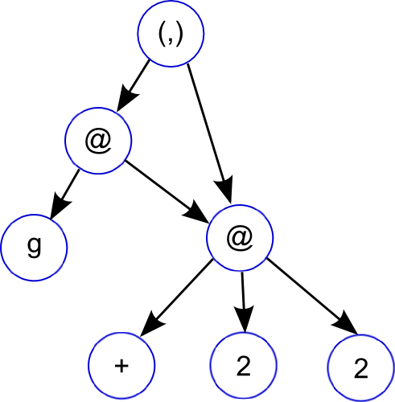
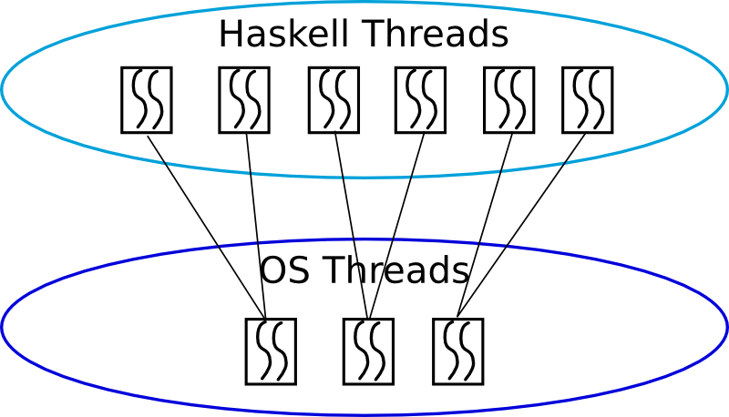
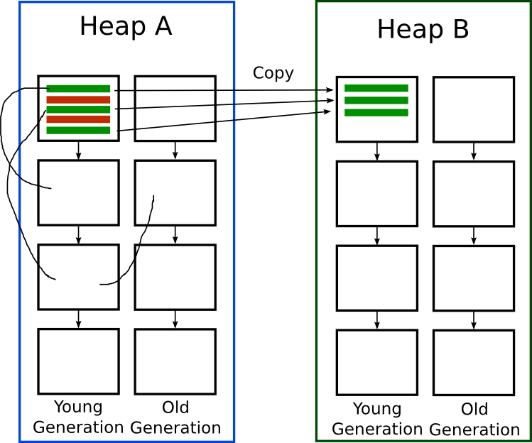

# Terminology 101

Two good resources for dealing with unknown terminology:

* [Foldoc: Free online dictionary of computing](http://foldoc.org/)
* [The Memory Management Refernce](http://www.memorymanagement.org/)

Lets cover some of the terminology now:

* _Values_: Both data and functions
* _Unboxed_: Primitive (machine level) types, not "boxed up" on the
  heap
* _Closure_: Heap allocated data associated with a method
* _Thunk_: A suspended computation
* _Continuations_: The cousin of closures. Unlike a closure you aren't
  simply calling a function, you are continuing a saved execution
  state. Basically though, if you have closures and tail calls as
  Haskell does, continuations can be built.

Yes, closures, thunks and continuations are all very similar. One
implementation can capture them all, however the terminology is used
to capture the different use cases.

# Graph Reduction

The way that lazy functional languages like Haskell are implemented is
through a technique called _graph reduction_

Its best to use the graph reduction model as an intuitive way to think
about how Haskell is evaluated, the actual way GHC implements Haskell
is pretty close to how an imperative language works.

~~~~ {.haskell}
f g = let x = 2 + 2
      in (g x, x)
~~~~

* Graph reduction allows lazy evaluation and sharing
* _let_: adds new node to graph
* _case_: expression evaluation, causes the graph to be reduced
* when a node is reduced, it is replaced (or _updated_) with its
  result

# Terminology 102

* _redex(es)_:  
   reducible expression. A expression that can be evaluated further
    * _normal form_:  
       an expression without an redexes
    * _head normal form_:  
      an expression where the top level (head) is neither a redex NOR
      a lambda abstraction with a reducible body
    * _weak head normal form_:  
      an expression where the top level (head) isn't a redex

* _unfolding_:  
  unfolding of a function f is just the body of f.
    * Unfolding = Inlining.

# Terminology 103

* evaluation strategies:
    * _call-by-value_: arguments evaluated before function entered
      (copied)
    * _call-by-name_: arguments passed unevaluated
    * _call-by-need_: arguments passed unevaluated but an expression
      is only evaluated once (sharing)
* _no-strict evaluation_ Vs. _lazy evaluation_:
    * non-strict: Includes both call-by-name and call-by-need, general
      term for evaluation strategies that don't evaluate arguments
      before entering a function
    * lazy evaluation: Specific type of non-strict evaluation. Uses
      call-by-need (for sharing).

# Front End: _Haskell -> Core_

Lets now look at how Haskell is compiled to
[Core](http://hackage.haskell.org/trac/ghc/wiki/Commentary/Compiler/CoreSynType).

* Core is a small lazy language functional language
* Learning Core is the most useful thing to get out of this lecture,
  experienced Haskell programmers that care about performance will
  look at Core.
* Think of it as a functional assembly language. Reasoning about
  behaviour and performance of Core is much simpler

# Terminology 104

* _kernel_: A kernel in programming language domain means the
  essential subset of the language. The 'base' of the language on
  which all other constructs are defined.
    * Core is a kernel for Haskell.
* _CAF_: (Constant Applicative Form) A top level constant, allocated
  for life time of program and shared. Since statically allocated
  garbage collector has to [treat them specially](http://hackage.haskell.org/trac/ghc/wiki/Commentary/Rts/Storage/GC/CAFs?redirectedfrom=Commentary/Rts/Storage/CAFs)
* _scrutinee_: The expression you are case'ing on in a case statement

# Data -> Core

Haskell

~~~~ {.haskell}
data Maybe a = Nothing | Just a

none = Nothing
some = Just (1 :: Int)
~~~~

Core

~~~~ {.haskell}
none :: forall a. Maybe a
none = Nothing

n :: GHC.Types.Int
n = GHC.Types.I# 1

some :: Maybe GHC.Types.Int
some = Just @ GHC.Types.Int n
~~~~

* Data types don't explicitly appear in Core
    * Core supports datatype but just no syntax for them at this level
<!--  e.g Its a struct definition, what code should be generated? None, only values appear as code -->
* Can see how GHC lifts constants out to the top level (CAFs)
* Can also see boxing and primitive types
    * In general Core follows same syntactic rules as Haskell (e.g
      Uppercase = Data constructor, # = unboxed value / type)

# Sharing & Updating

Haskell

~~~~ {.haskell}
sum100 :: Int -> Int
sum100 n = foldr (+) 0 [1..100]
~~~~

Core

~~~~ {.haskell}
-- Unoptimized
sum100n = \ (n :: Int) -> * n (foldr (I# 0) (enumFromTo (I# 1) (I# 100)))

-- Optimized
sum100n = \ (n :: Int) -> GHC.Base.timesInt n sum100n1

sum100n1 = case $wgo 1 of r { __DEFAULT -> GHC.Types.I# r }

$wgo :: Int# -> Int#
$wgo = \ (w :: Int#) ->
    case w of w'
      __DEFAULT -> case $wgo (GHC.Prim.+# w' 1) of r
                      __DEFAULT -> GHC.Prim.+# w' r
      100 -> 100
~~~~

* For the optimized case GHC lifts the constant expression out so its
  only computed once and then shared
* Optimized version creates a new function called `$wgo` which means
  'worker'. This version works with unboxed types for efficiency.

# Partial Evaluation -> Core

Haskell

~~~~ {.haskell}
add :: Int -> Int -> Int
add x y = x + y

add2 :: Int -> Int
add2 = add 2
~~~~

Core (unoptimized)

~~~~ {.haskell}
add :: GHC.Types.Int -> GHC.Types.Int -> GHC.Types.Int
add =
  \ (x :: GHC.Types.Int) (y :: GHC.Types.Int) ->
    GHC.Num.+ @ GHC.Types.Int GHC.Num.$fNumInt x y

x :: GHC.Types.Int
x = GHC.Types.I# 2

add2 :: GHC.Types.Int -> GHC.Types.Int
add2 =
  \ (y :: GHC.Types.Int) ->
    GHC.Num.+ @ GHC.Types.Int GHC.Num.$fNumInt x y
~~~~

* (+) function used is the polymorphic `GHC.Num.+` variant
    * `GHC.Num.+ @ GHC.Types.Int GHC.Num.$fNumtInt` means, select the
      (+) field from the GHC.Types.Int dictionary (which is retrieved
      from GHC.Num.$fNumInt) for the GHC.Num type class

# Partial Evaluation -> Core

Haskell

~~~~ {.haskell}
add :: Int -> Int -> Int
add x y = x + y

add2 :: Int -> Int
add2 = add 2
~~~~

Core (optimized)

~~~~ {.haskell}
add :: GHC.Types.Int -> GHC.Types.Int -> GHC.Types.Int
Hs2Core.add = GHC.Base.plusInt

x :: GHC.Types.Int
x = GHC.Types.I# 2

add2 :: GHC.Types.Int -> GHC.Types.Int
add2 = GHC.Base.plusInt x
~~~~

* type class dictionary method has been inlined.

# (+) -> Core

The function `GHC.Base.plusInt` is implemented as:

~~~~ {.haskell}
+ :: Int -> Int -> Int
+ = \ a b -> case a of _
                 I# a_ -> case b of _
                              I# b_ -> I# (GHC.Prim.+# a_ b_)
~~~~

* Notice the evaluation and unboxing of each argument, followed
  finally by reboxing.

# IO -> Core

* Monads are just type classes. So much of previous applies.
* IO Monad is basically a state passing monad. Passes around the 'Real
  World' so that IO actions can transform it.

~~~~ {.haskell}
newtype IO a = IO (State# RealWorld -> (# State# RealWorld, a #))
~~~~

* 'Real Wold' is represented in GHC by a special token
* At the base, there are some primitive IO actions.
* IO Monad builds on top of RealWord# and the primitive IO actions.

Haskell

~~~~ {.haskell}
f :: IO ()
f = do
   putStrLn "Hello World"
   putStrLn "What's up today?"
~~~~

# IO -> Core

Core (Unoptimized)

~~~~ {.haskell}
g :: GHC.Types.IO ()
g =
  GHC.Base.>> @ GHC.Types.IO GHC.Base.$fMonadIO @ () @ ()
    (System.IO.putStrLn (GHC.Base.unpackCString# "Hello World"))
    (System.IO.putStrLn (GHC.Base.unpackCString# "What's up today?"))
~~~~

Core (optimized)

~~~~ {.haskell}
f :: GHC.Prim.State# GHC.Prim.RealWorld -> (# GHC.Prim.State# GHC.Prim.RealWorld, () #)
f =
  \ (world :: GHC.Prim.State# GHC.Prim.RealWorld) ->
    case hPutStr2 stdout f1 True world of _
       (# new_world, _ #) -> hPutStr2 stdout f2 True new_world

f1 :: [GHC.Types.Char]
f2 = GHC.Base.unpackCString# "Hello World"

f2 :: [GHC.Types.Char]
f1 = GHC.Base.unpackCString# "What's up today?"
~~~~

* `unpackCString#` takes a C style string and turns it into a Haskell
  String

# Lazy Evaluation -> Core

Haskell

~~~~ {.haskell}
foldl :: (a -> b -> a) -> a -> [b] -> a

foldl' :: (a -> b -> a) -> a -> [b] -> a

forcee :: a -> b -> b
forccee = seq
~~~~

Core

~~~~ {.haskell}
foldl = \ (f :: a -> b -> a) (z :: a) (d :: [b]) ->
    case d of _
      [] -> z;
      : x xs -> foldl f (f z x) xs

foldl' = \ (f :: a -> b -> a) (z :: a) (d :: [b]) ->
    case d of _
      [] -> z;
      : x xs ->
        case f z x of z'
           __DEFAULT -> foldl' b f z' xs

forccee = \ (x :: a) (y :: b) -> case x of _ { __DEFAULT -> y }
~~~~

* Notice the exta `case` statement in foldl' to force evaluation

# Middle of GHC: _Core -> Core_

A lot of the optimizations that GHC does is through core to core
transformations.

* Inlining, CSE, DCE
* Strictness
* Float In
* Full Laziness
* Specialise
* Spec Constr
* Liberate Case
* Lambda Eta Expansion
* Do Eta Reduction
* Case Merge
* Static Argument Transformation

# Some standard optimisations

* GHC does some stock standard optimisations: Inlining, Common
  Subexpression Elimination, Dead Code Elimination
* A large set of simple, local optimisations (e.g constant folding)
  are done in one pass called the _simplifier_. It is run repeatedly
  until not further changes can be done (with a fixed maximum number
  of iterations).
* These are only the basic, big win ones. All the other standard stuff
  (e.g strength reduction, loop induction...) are missing.
* We get a lot of this for free though if we use the LLVM backend.

Rest of the optimisations GHC does are fairly specific to a functional
language. Lets look at a few of them.

<!--
     Float In: move `let` bindings inwards to an expression as far as
     possible adv: allocation may never occur now, strictness analysis
     has better chance now since let binding is as close to its use as
     possible
    
     Full Laziness (or Float Out [Haskell silly naming]): move `let`
     bindings outwards adv: work may now be shared (e.g think a
     recursive function, floating out a let binding), can move `let`
     bindings to a common place which saves heap-overflow checks that
     must be done since let = allocation dis: may allocate a thunk now
     thats never used, strictness analysis less likely to fire

     Specialise: Use partial evaluation to create specialised version
     of overloaded functions. (e.g functions using Typeclasses will
     have variants created that use concrete instances of the class)

     Lambda Eta Expansion: let f = \x -> let ... in \y -> E in B =>
     let f = \x y -> let .. in E in B transform nested serries of
     lambdas into one with multiple arguments.  Need to ensure though
     that `f` is always applied to two arguments for correctness.

     Fusion / Deforestation: transformation that removes intermediate
     lists in expressions like sum (map double xs).

     lambda lifting: lift locally defined functions to top level
     global functions by adding arguments for the free variables.

     lambda dropping: (aka Static argument transformation) move top
     level function into its call site as a local function.

     TODO: escape analysis?

The liberate-case transformation
~~~~~~~~~~~~~~~~~~~~~~~~~~~~~~~~
This module walks over @Core@, and looks for @case@ on free variables.
The criterion is:
  if there is case on a free on the route to the recursive call,
  then the recursive call is replaced with an unfolding.

Example

   f = \ t -> case v of
           V a b -> a : f t

=> the inner f is replaced.

   f = \ t -> case v of
           V a b -> a : (letrec
        f =  \ t -> case v of
                 V a b -> a : f t
             in f) t
(note the NEED for shadowing)

=> Simplify

  f = \ t -> case v of
           V a b -> a : (letrec
        f = \ t -> a : f t
             in f t)

Better code, because 'a' is  free inside the inner letrec, rather
than needing projection from v.

Note that this deals with *free variables*.  SpecConstr deals with
*arguments* that are of known form.  E.g.
-->

# STG Code

* In the next few slides the code Ill be showing isn't exactly Core
  but a IR GHC uses after Core called STG. (Ive cleaned up the STG
  though so its not `true` syntax)

* STG is very similar to Core but has one nice additional property:
    * laziness is 'explicit'
    * `case` = _evaluation_ and ONLY place evaluation occurs (true in
      Core)
    * `let` = _allocation_ and ONLY place allocation occurs (not true
      in Core)
    * So in STG we can explicitly see thunks being allocated for
      laziness using `let`

* To view STG use: 

    ~~~~
    ghc -ddump-stg A.hs > A.stg
    ~~~~

# Strictness & Unboxing

* This can be a huge performance penalty in numeric heavy code if the
  implementation is naive

* If we can we want to work with unboxed values as long and as much as
  possible
    * We can only do this though when we have determined that a value
      `x` will always be evaluated (i.e is 'strict') to avoid breaking
      the lazy semantics of Haskell

# Backend: _Core -> Assembly_

Final stage of GHC is compiling Core to an executable. The backend is
in two parts:

* STG -> Cmm: called the code generator in GHC

Cmm is a low level imperative language used in GHC. Basically a very
simple C like language. Just enough to abstract away hardware
registers, call conventions:

* Cmm exists to provide a common (easy) IR for the final backends to
  work with.
* There are three _Cmm -> Object code_ backends in GHC: C code
  generator using GCC, Native assembly code generator and an LLVM code
  generator.
* C is for portability, NCG is for compilation speed, LLVM is for
  'performance' and the future

# _STG -> Cmm_

So what has been handled and what is left to handle?

*  By the STG stage we have:
    * Simplified Haskell to a handful of constructs (variables,
      literal, let, lambda, case and application)
    * type classes, monads have all been dealt with
    * laziness is nearly explicit through let constructs for
      allocation and case for evaluation

* So we still have to deal with:
    * Compiling these constructs efficiently, big focus will be
      handling closures and garbage collection (lazy functional
      languages involve a lot of allocation of short lived objects)
    * Partial application (only remaining implicit allocation)
    * Evaluating thunks and handling updates

# The STG Machine

The way the operational semantics of the STG language is defined is by
an abstract machine called 'The STG Machine'.

* The idea of an abstract machine is to give an operational semantics
  to a language (STG in this case) that the source language (Haskell
  in this case) can be 'easily' mapped to.
* But the abstract machine should also define an efficient way it
  itself can be implemented on standard hardware.
* So basically its a virtual machine stepping stone. LLVM is a good
  modern day example of this that is fairly widely known.

# _STG Machine -> Cmm_

Lets just look at some of the details of the code generator. The final
backends are all pretty straight forward (think simple C compiler).
The important parts of the code generator are:

* Closure representation
* Heap and Stack layout
* Call convention & partial application
* Graph reduction: thunks, update frames and black holes
* Case statements
* Pointer tagging and evaluation
* RTS and Garbage Collection

* Thunks:

    ~~~~ {.haskell}
    range = between 1 10
    f = \x -> let ys = take x range
              in sum ys
    ~~~~
   
    * [Header | Pointers... | Non-pointers...]
    * Payload contains the free variables of the expression
    * Differ from function closure in that they can be updated
    * Clousre types of: THUNK, THUNK_p_n, THUNK_STATIC (`range` is a
      static thunk, `ys` is a dynamic thunk)
    * Entry code is the code for the expression

# Heap & Stack Layout

GHC has a very nice uniform way of managing the heap and stack.

* Heap:
    * Heap at the lowest level is a linked list of blocks.
    * All objects in the heap are represented by closure objects
    * Even when for some of them the entry code doesn't make sense
    * When entry code doesn't make sense, the code will either be
      code that simply returns or code that throws and error

* Stack:
    * The stack consists of a sequence of _frames_
    * Each frame has the same layout as a heap object! So the stack
      and the heap can often be treated uniformily
    * Stacks until very recently were a single contiguous block of
      memory. They are now a linked list of stack chunks.
    * chunked stacks can be grown far easier but also are quicker to
      traverse during GC since we can avoid entire chunks of the
      stack if they haven't been touched since last GC.

* TSO (thread state object):
    * Represents the complete state of a thread including it stack
    * Are ordinary objects that live in the heap
    * Important benefit of this approach is the GC can detect when
      a blocked thread is unreachable and so will never be runnable
      again

# Terminology 105

* _activation record_: An alternative name for a stack frame
* _forcing_: In the context of a thunk it means evaluating it
* _entering_: In the context of a closure it means evaluating it
* _node_: Node in the context of the entry code for a closure is a
  pointer to the environment for the closure

# Call Convention

<!--
(during a call is the only time a stack doesn't simply consist of
closure objects as there are now arguments at the top)
-->

* GHC compiles code into a form called _Continuation Passing Style_:
    * The idea here is that no function ever returns
    * Instead a function returns by jumping to the closure at the top
      of the stack
    * Basically the code is always jumping from closure to closure so
      before calling a function we simply setup the stack correctly to
      have the control chain on it we want.
* Call convention is simple: first _n_ arguments in registers, rest on
  the stack
* When entering a closure (a common case) the first argument is
  always a pointer to the closures heap object (node) so it can access
  its environment
* Return convention is also simple, return is made by jumping to the
  entry code associated with the _info table_ of the topmost stack
  frame OR in some cases we set the _R1_ register to point to the
  return closure

~~~~ {.haskell}
id' x = x
~~~~

~~~~ {.c}
A_idzq_entry()
    R1 = R2;
    jump stg_ap_0_fast ();
~~~~

~~~~ {.c}
stg_ap_0_fast { 
  ENTER();
}

#define ENTER()
  // ...
  case
    FUN,
    // ...
    PAP:     { jump %ENTRY_CODE(Sp(0)); }
    default: { info = %INFO_PTR(UNTAG(R1)); jump %ENTRY_CODE(info); }
~~~~

# Call Convention

Calling a known Haskell function:

Haskell

~~~~ {.haskell}
x :: Int -> Int
x z = (+) 2 (id z)
~~~~

Cmm

~~~~ {.c}
I64[Hp - 8] = spH_info;                  // create thunk on heap
I64[Hp + 0] = R2;                        // R2 = z, store argument in closure
R2 = stg_INTLIKE_closure+289;            // first argument (static closure for '2')
R3 = Hp - 16;                            // second argument (closure pointer)
jump base_GHCziBase_plusInt ();          // call (+) function
~~~~ 

# Call Convention

What happens though when we are calling an unknown function?

Haskell

~~~~ {.haskell}
unknown_app :: (Int -> Int) -> Int -> Int
unknown_app f x = f x
~~~~

Cmm

~~~~ {.c}
unknownzuapp_entry() {
    cnO:
        R1 = R2;
        Sp = Sp + 4;
        jump stg_ap_p_fast ();
}
~~~~

* Here we don't call the function directly as we don't statically known
  the arity of the function.

* To deal with this, the STG machine has several pre-compiled functions
  that handle 'generic application'

* Generic application has three cases to deal with:
    * The functions arity and number of arguments match! So we simply
      make a tail call to the functions entry code.
    * The functions arity is greater than the number of supplied
      argumnts. In this case we build a PAP closure and return that
      closure to the continuation at the top of the stack
    * The functions arity is less than the number of supplied
      arguments. Here we push the number of arguments matching the
      functions arity onto the stack, followed by a new continuation
      that uses another generic apply function to deal with the
      remaining arguments and the function that should be returned by
      the first function.

# Data Constructors

Haskell

~~~~ {.haskell}
10
~~~~

Cmm

~~~~ {.c}
section "data" {
    A_ten_closure:
        const ghczmprim_GHCziTypes_Izh_static_info;
        const 10;
}
~~~~

* Pointer to Constructor (`I#`)
* arguments to constructor (`10`)

# Pointer Tagging

* An optimization that GHC does is _pointer tagging_. The trick is to
  use the final bits of a pointer which are usually zero (last 2 for
  32bit, 3 on 64) for storing a 'tag'.

* GHC uses this tag for:
    * If the object is a constructor, the tag contains the constructor
      number (if it fits)
    * If the object is a function, the tag contains the arity of the
      function (if it fits)

* One optimization tag bit enable is that we can detect if a closure
  has already been evaluated (by the presence of tag bits) and avoid
  entering it

# Data Constructors

Haskell

~~~~ {.haskell}
build_just :: a -> Maybe a
build_just x = Just x
~~~~

Cmm

~~~~ {.c}
buildzujust_entry()
    crp:
        Hp = Hp + 16;
        if (Hp > HpLim) goto crt;                        // Allocte heap space
        I64[Hp - 8] = base_DataziMaybe_Just_con_info;    // Just constructor tag
        I64[Hp + 0] = R2;                                // store x in Just
        R1 = Hp - 6;                                     // setup R1 as argument to continuation
                                                         //     (we do '- 6' and not '8' to set the pointer tag)
        jump (I64[Sp + 0]) ();                           // jump to continuation
    cru:
        R1 = buildzujust_closure;
        jump stg_gc_fun ();
    crt:
        HpAlloc = 16;
        goto cru;
}
~~~~

# Case Statements

Haskell

~~~~ {.haskell}
mycase :: Maybe Int -> Int
mycase x = case x of Just z -> z; Nothing -> 10

~~~~

Cmm

~~~~ {.c}
mycase_entry()                          // corresponds to forcing 'x'
    crG:
        R1 = R2;                        // R1 = 'x'
        I64[Sp - 8] = src_info;         // setup case continuation
        Sp = Sp - 8;
        if (R1 & 7 != 0) goto crL;      // check pointer tag to see if x eval'd
        jump I64[R1] ();                // x not eval'd, so eval
    crL:
        jump src_info ();               // jump to case continuation
}

src_ret()                               // case continuation
    crC:
        v::I64 = R1 & 7;                // get tag bits of 'x' and put in local variable 'v'
        if (_crD::I64 >= 2) goto crE;   // can use tag bits to check which constructor we have
        R1 = stg_INTLIKE_closure+417;   // 'Nothing' case
        Sp = Sp + 8;                    // pop stack
        jump (I64[Sp + 0]) ();          // jump to continuation ~= return
    crE:
        R1 = I64[R1 + 6];               // get 'z' thunk inside Just
        Sp = Sp + 8;                    // pop stack
        R1 = R1 & (-8);                 // clear tags on 'z'
        jump I64[R1] ();                // force 'z' thunk
}
~~~~

# Graph Reduction: Thunks, Updates & Indirections

Lets take a look at the code for the `(x + 1)` thunk:

~~~~ {.haskell}
build_data :: Int -> Maybe Int
build_data x = Just (x + 1)
~~~~

Cmm

~~~~ {.c}
sus_entry()
    cxa:
        if (Sp - 24 < SpLim) goto cxc;
        I64[Sp - 16] = stg_upd_frame_info;  // setup update frame (closure type)
        I64[Sp -  8] = R1;                  // set thunk to be updated (payload)
        I64[Sp - 24] = sut_info;            // setup continuation (+) continuation
        Sp = Sp - 24;                       // increase stack
        R1 = I64[R1 + 16];                  // grab 'x' from environment
        if (R1 & 7 != 0) goto cxd;          // check if 'x' is eval'd
        jump I64[R1] ();                    // not eval'd so eval
    cxc: jump stg_gc_enter_1 ();
    cxd: jump sut_info ();                  // 'x' eval'd so jump to (+) continuation
}

sut_ret()
    cx0:
        Hp = Hp + 16;
        if (Hp > HpLim) goto cx5;
        v::I64 = I64[R1 + 7] + 1;           // perform ('x' + 1)
        I64[Hp - 8] = ghczmprim_GHCziTypes_Izh_con_info; // setup Int closure
        I64[Hp + 0] = v::I64;               // setup Int closure
        R1 = Hp - 7;                        // point R1 to computed thunk value (with tag)
        Sp = Sp + 8;                        // pop stack
        jump (I64[Sp + 0]) ();              // jump to continuation ('stg_upd_frame_info')
    cx6: jump stg_gc_enter_1 ();
    cx5:
        HpAlloc = 16;
        goto cx6;
}
~~~~

# Graph Reduction: Thunks & Updates

* The interesting thing here is that once the thunk is forced and
  computes `(x + 1)` it doesn't return to the continuation at the top
  of the stack

~~~~ {.c}
I64[Sp - 16] = stg_upd_frame_info;  // setup update frame (closure type)
I64[Sp -  8] = R1;                  // set thunk to be updated (payload)
~~~~

* Instead it returns to the `stg_upd_frame_info` function
* This function is reponsible for taking the thunks computed value and
  replacing the thunk with this computed value to avoid it being
  recomputed
* The replacing is done by changing the entry code for the thunk to be
  an 'indirection' which is simply code that returns a pointer to
  another closure.
* The GC will remove indirections during copying, changing code that
  pointed to a indirection (evaluated thunk) to the actual value
  closure.

# RTS & Garbage Collection

* GHC has a n:m threading model:
    * n Haskell light weight threads running on m OS threads (thread pool model)
    * context switches can occur when garbage collection checks are invoked
      based on typical time slice model with round robbin scheduling
    * the frequency of this gives close to a pre-emptive thread model

# RTS & Garbage Collection

* GC uses a [generational copy collector design](http://hackage.haskell.org/trac/ghc/wiki/Commentary/Rts/Storage/GC)
    * Basic idea of a generational collector is to divide objects up
      into generations (time they've been alive) since young objects
      have a higher probability of becoming garbage. We can now just
      GC one generation at a time in an incremental fashion to speed
      up GC.
    * Basic idea of a copy collectors is you have two heaps, one is
      the current heap and during GC you start with a list of known
      live objects
      (["roots"](http://hackage.haskell.org/trac/ghc/wiki/Commentary/Rts/Storage/GC/Roots)),
      recurisvely trace their dependencies (finding live objects) and
      copy all found objects to the other heap. Anything not copied
      isn't referenced by anything so is dead. Now switch heaps.

# RTS & Garbage Collection

* [Block Allocator](http://hackage.haskell.org/trac/ghc/wiki/Commentary/Rts/Storage/BlockAlloc)
  is at the base of the GC:
    * Uses a linked list of blocks where within a block we allocate
      using a simple bump pointer (heap and stack mangaged this way)
    * Bump pointer is where we simply have a current block to allocate with
      a pointer to the next free space to allocate in. To allocate we check
      there is enough space left in the block and if so bump the pointer
    * Block size is chosen such that it's rare we need to allocate an
      object larger than a block

    ~~~~ {.c}
    AMod_abc_entry:
      entry:
        _v = R2                        // collect arguments
        _w = R3
        if (Sp - 40 < SpLim) goto spL  // check enough stack free
        Hp = Hp + 20                   // allocate heap space
        if (Hp > HpLim) goto hpL       // check allocation is ok

        [... funtion code now we have stack and heap space needed ...]
    
        Sp = Sp - 32                   // bump stack pointer to next free word
        jump ...                       // jump to next continuation

      hpL:
        HpAlloc = 20                   // inform how much hp space we need

      spL:
        R1 = AMod_abc_closure;         // set return point
        jump stg_gc_fun                // call GC
    ~~~~

    * Above is the _Cmm_ code typically generated for functions that
      need to allocate. Notice we simply bump the `Hp` and `Sp`
      registers for allocation after we check there is enough space.
    * We don't need to tell the GC how much stack to allocate as it
      just allocates the stack in fixed block sizes

# Bringing it all home

No lecture on Compilers is complete without assembly code!

~~~~ {.haskell}
add :: Int -> Int -> Int
add x y = x + y + 2
~~~~

~~~~ {.assembly}
A_add_info:
.LcvZ:
	leaq -16(%rbp),%rax
	cmpq %r15,%rax
	jb .Lcw1
	movq %rsi,-8(%rbp)
	movq %r14,%rbx
	movq $sul_info,-16(%rbp)
	addq $-16,%rbp
	testq $7,%rbx
	jne sul_info
	jmp *(%rbx)
.Lcw1:
	movl $A_add_closure,%ebx
	jmp *-8(%r13)

sul_info:
.LcvS:
	movq 8(%rbp),%rax
	movq 7(%rbx),%rcx
	movq %rcx,8(%rbp)
	movq %rax,%rbx
	movq $suk_info,0(%rbp)
	testq $7,%rbx
	jne suk_info
	jmp *(%rbx)

suk_info:
.LcvK:
	addq $16,%r12
	cmpq 144(%r13),%r12
	ja .LcvP
	movq 7(%rbx),%rax
	addq $2,%rax
	movq 8(%rbp),%rcx
	addq %rax,%rcx
	movq $ghczmprim_GHCziTypes_Izh_con_info,-8(%r12)
	movq %rcx,0(%r12)
	leaq -7(%r12),%rbx
	addq $16,%rbp
	jmp *0(%rbp)
.LcvP:
	movq $16,184(%r13)
.LcvQ:
	jmp *-16(%r13)
~~~~

# Finished!

* So that's is all I can cover in this lecture.

* I haven't covered a few significant areas:
    * Typechecking
    * The scheduler: threads, multi-processor support
    * Foreign Function Interface
    * Profiling
    * Infrastructure of the compiler: Interface files, packages,
      modular compilation... ect
    * Final code generators
    * GHCi
    * The finer details of lazy evaluation: sharing, update frames,
      blackholes

# Resources & References

Here are some resources to learn about GHC, they were also used to
create these slides:

* GHC Wiki: [Developer Documentation](http://hackage.haskell.org/trac/ghc/wiki/Commentary)
* GHC Wiki: [I know kung fu: learning STG by example](http://hackage.haskell.org/trac/ghc/wiki/Commentary/Compiler/GeneratedCode)
* Wikipedia: [System F](http://en.wikipedia.org/wiki/System_F)
* Paper: [Multi-paradigm Just-In-Time Compilation](http://www.cse.unsw.edu.au/~pls/thesis/dons-thesis.ps.gz)
* Paper: [Implementing lazy functional languages on stock hardware: the Spineless Tagless G-machine](http://research.microsoft.com/en-us/um/people/simonpj/papers/spineless-tagless-gmachine.ps.gz#26pub=34)
* Paper: [Implementing Functional Languages: a tutorial](http://research.microsoft.com/en-us/um/people/simonpj/papers/pj-lester-book/)
* Paper: [Runtime support for Multicore Haskell](http://research.microsoft.com/apps/pubs/default.aspx?id=79856)
* Paper: [Multicore Garbage Collection with Local Heaps](http://www.google.com/url?sa=t&rct=j&q=Multicore%2BGarbage%2BCollection%2Bwith%2BLocal%2BHeaps&source=web&cd=1&ved=0CCAQFjAA&url=http%3A%2F%2Fcommunity.haskell.org%2F~simonmar%2Fpapers%2Flocal-gc.pdf&ei=YmXBTq3hLoatiAKq3tT5Ag&usg=AFQjCNGH0SgCfqpKQkQxq11Azl3btSk5Dw&sig2=OVzFyZrZRopkhlo7yriv_w)
* Paper: [Parallel generational-copying garbage collection with a block-structured heap](http://research.microsoft.com/en-us/um/people/simonpj/papers/parallel-gc/index.htm)
* Paper: [Making a fast curry: Push/enter vs eval/apply for higher-order languages](http://research.microsoft.com/en-us/um/people/simonpj/papers/eval-apply/)
* Paper: [An External Representation for the GHC Core Language](http://www.haskell.org/ghc/docs/6.10.4/html/ext-core/core.pdf)
* Paper: [A transformation-based optimiser for Haskell](http://research.microsoft.com/~simonpj/Papers/comp-by-trans-scp.ps.gz)
* Paper: [Playing by the rules: rewriting as a practical optimisation technique in GHC](http://research.microsoft.com/~simonpj/Papers/rules.htm)
* Paper: [Secrets of the Inliner](http://www.research.microsoft.com/~simonpj/Papers/inlining/index.htm)
* Paper: [Unboxed Values as First-Class Citizens](http://www.haskell.org/ghc/docs/papers/unboxed-values.ps.gz)

